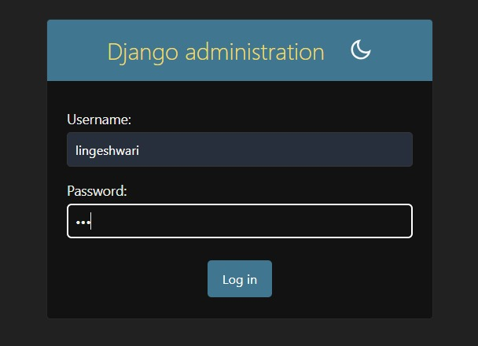
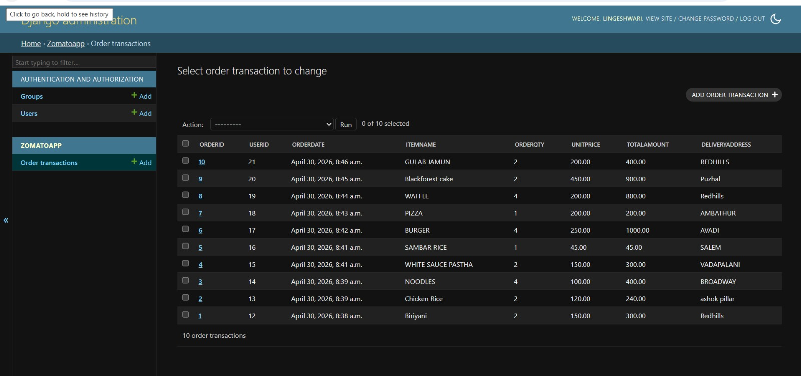

# Ex01 Django ORM Web Application
## Date:

## AIM
To develop a Django application to manage an online food delivery platform like Zomato/Swiggy using Object Relational Mapping (ORM).

## ENTITY RELATIONSHIP DIAGRAM


## DESIGN STEPS

### STEP 1:
Clone the problem from GitHub

### STEP 2:
Create a new app in Django project

### STEP 3:
Enter the code for admin.py and models.py

### STEP 4:
Execute Django admin and create details for 10 books

## PROGRAM
MODELS
```
from django.db import models
from django.contrib import admin
from django.db import models

class OrderTransaction(models.Model):
    OrderID = models.IntegerField(primary_key=True)
    UserID = models.IntegerField()
    OrderDate = models.DateTimeField(auto_now_add=True)
    ItemName = models.CharField(max_length=200)
    OrderQty = models.IntegerField()
    UnitPrice = models.DecimalField(max_digits=10, decimal_places=2)
    TotalAmount = models.DecimalField(max_digits=10, decimal_places=2)
    DeliveryAddress = models.CharField(max_length=300)
class OrderTransactionAdmin(admin.ModelAdmin):
    list_display=('OrderID','UserID','OrderDate','ItemName','OrderQty','UnitPrice','TotalAmount','DeliveryAddress')
```
ADMIN
```from django.contrib import admin

from .models import OrderTransaction,OrderTransactionAdmin
admin.site.register(OrderTransaction,OrderTransactionAdmin)
```    


## OUTPUT



## RESULT
Thus the program for creating a database using ORM hass been executed successfully
